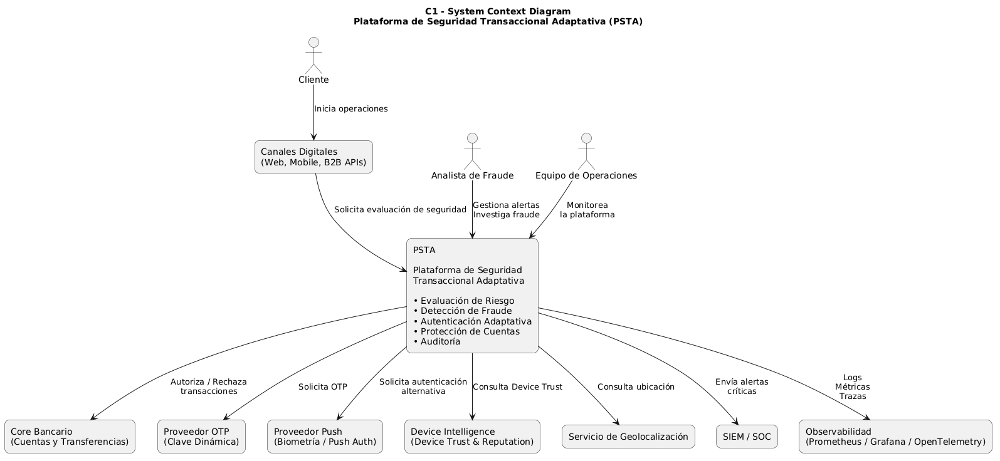
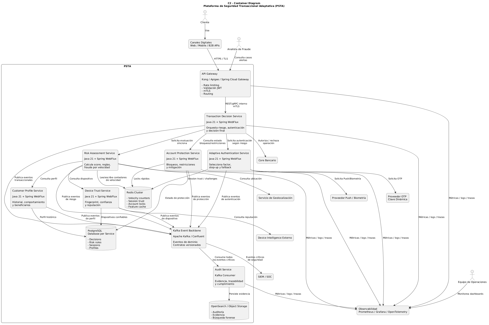

# Arquitectura Lógica

## Propósito

La arquitectura lógica describe cómo la Plataforma de Seguridad Transaccional Adaptativa (PSTA) está estructurada para cumplir los objetivos de negocio relacionados con:

- Detección temprana de fraude.
- Autenticación adaptativa.
- Resiliencia ante fallos de proveedores externos.
- Protección de cuentas.
- Trazabilidad y auditoría.
- Escalabilidad para procesamiento transaccional en tiempo real.

La solución adopta una combinación de:

- Domain-Driven Design (DDD)
- Event-Driven Architecture (EDA)
- Arquitectura Reactiva
- Microservicios
- Consistencia Eventual

---

# Vista General

La solución está organizada utilizando el modelo C4:

| Nivel | Propósito |
|---------|------------|
| C1 | Comprender el sistema y sus interacciones externas |
| C2 | Comprender los contenedores que componen la solución |
| C3 | Comprender la estructura interna de los componentes críticos |

---

# C1 - System Context Diagram

El diagrama de contexto muestra la posición de la Plataforma de Seguridad Transaccional Adaptativa dentro del ecosistema bancario.



## Objetivo

Identificar:

- Usuarios del sistema.
- Sistemas externos.
- Integraciones principales.
- Responsabilidades de la plataforma.

## Actores

| Actor / Rol | Descripción |
| :--- | :--- |
| **Cliente** | Inicia operaciones financieras desde los canales digitales. |
| **Analista de Fraude** | Gestiona alertas, revisa casos sospechosos y ejecuta acciones de investigación. |
| **Equipo de Operaciones** | Monitorea el comportamiento operativo de la plataforma. |

---

## Sistemas Externos

| Sistema Externo | Descripción |
| :--- | :--- |
| **Canales Digitales** | Origen de las solicitudes transaccionales. |
| **Core Bancario** | Responsable de ejecutar las operaciones financieras aprobadas. |
| **Proveedor OTP** | Suministra mecanismos de autenticación mediante clave dinámica. |
| **Proveedor Push** | Suministra autenticación basada en notificaciones push y biometría. |
| **Device Intelligence** | Provee información de reputación y confianza de dispositivos. |
| **Servicio de Geolocalización** | Permite identificar anomalías geográficas. |
| **SIEM / SOC** | Recibe eventos críticos de seguridad. |
| **Plataforma de Observabilidad** | Centraliza métricas, logs y trazas. |

---

# C2 - Container Diagram

El diagrama de contenedores muestra la estructura interna de la solución.



## Objetivo

Describir:

- Microservicios.
- Componentes de infraestructura.
- Integraciones.
- Flujos de comunicación.

---

## Principios Arquitectónicos

| Principio Arquitectónico | Descripción |
| :--- | :--- |
| **Microservicios** | Cada dominio principal es implementado mediante un servicio independiente. |
| **Event Driven Architecture** | La comunicación entre servicios se realiza mediante eventos publicados en Kafka. |
| **Database per Service** | Cada servicio mantiene autonomía sobre sus datos. |
| **Consistencia Eventual** | Las decisiones de negocio se propagan mediante eventos asincrónicos. |

---

## Contenedores Principales

### API Gateway

Punto de entrada único para los canales digitales.

**Responsabilidades**

- Routing.
- Validación de identidad.
- Rate limiting.
- Observabilidad.

---

### Transaction Decision Service

Responsable de la decisión final de una transacción.

**Publica**

- TransactionReceived
- TransactionApproved
- TransactionRejected
- TransactionRequiresAuthentication

---

### Risk Assessment Service

Evalúa el riesgo asociado a cada operación.

**Responsabilidades**

- Fraude por velocidad.
- Evaluación de señales.
- Perfilamiento de comportamiento.
- Generación de score de riesgo.

---

### Adaptive Authentication Service

Selecciona y ejecuta mecanismos de autenticación según el riesgo calculado.

**Responsabilidades**

- OTP.
- Push Authentication.
- Biometría.
- Fallback automático.

---

### Account Protection Service

Aplica medidas de mitigación.

**Responsabilidades**

- Bloqueo de cuentas.
- Restricciones.
- Step-Up Authentication.

---

### Device Trust Service

Gestiona la confianza de dispositivos.

---

### Customer Profile Service

Mantiene el contexto histórico y comportamiento del cliente.

---

### Audit Service

Consolida evidencia y trazabilidad para auditoría y cumplimiento.

---

## Infraestructura

### Apache Kafka

Backbone de eventos de la plataforma.

Permite:

- Desacoplamiento.
- Escalabilidad.
- Consistencia eventual.

---

### Redis

Utilizado para:

- Detección de fraude por velocidad.
- Caché de sesión.
- Estado transaccional de corta duración.

---

### PostgreSQL

Persistencia principal por servicio.

Implementa el patrón:

```text
Database per Service
```

---

### OpenSearch

Búsqueda y análisis de auditoría.

---

# C3 - Component Diagrams

Los diagramas de componentes describen los servicios críticos para la solución.

---

# C3 - Risk Assessment Service


## Responsabilidad

Calcular el nivel de riesgo asociado a una operación financiera.

## Componentes Principales

### Risk Orchestrator

Coordina el flujo completo de evaluación.

### Transaction Context Builder

Construye el contexto necesario para la evaluación:

- Perfil del cliente.
- Dispositivo.
- Geolocalización.
- Contexto transaccional.

### Velocity Engine

Evalúa patrones de velocidad:

- Número de transacciones.
- Monto acumulado.
- Beneficiarios nuevos.
- Ventanas de tiempo.

### Device Risk Engine

Evalúa el riesgo asociado al dispositivo utilizado.

### Behavior Profiling Engine

Compara la operación contra el comportamiento histórico del cliente.

### Geo Risk Engine

Detecta anomalías geográficas.

### Fraud Rule Engine

Aplica reglas de negocio auditables y explicables.

### Risk Score Calculator

Calcula:

- RiskScore
- RiskLevel

### RiskAssessment Aggregate

Mantiene consistencia de las decisiones de riesgo.

---

## Resultado

Publica eventos:

- RiskScoreCalculated
- FraudPatternDetected
- CriticalRiskDetected

---

# C3 - Adaptive Authentication Service


## Responsabilidad

Determinar y ejecutar el mecanismo de autenticación apropiado según el contexto de riesgo.

---

## Componentes Principales

### Authentication Orchestrator

Coordina el flujo de autenticación.

### Factor Selection Policy

Selecciona el factor más apropiado según:

- Riesgo.
- Confianza de sesión.
- Disponibilidad de proveedores.

### Session Trust Manager

Gestiona la confianza de la sesión activa.

### Challenge Manager

Administra desafíos de autenticación.

### Fallback Engine

Permite cambiar automáticamente de proveedor o factor de autenticación.

### Circuit Breaker Manager

Evita la propagación de fallos de proveedores externos.

### OTP Adapter

Adaptador hacia el proveedor de clave dinámica.

### Push Adapter

Adaptador hacia el proveedor de autenticación push.

### Biometric Adapter

Adaptador hacia el proveedor biométrico.

### AuthenticationSession Aggregate

Mantiene consistencia del proceso de autenticación.

---

## Escenario de Resiliencia

Ante una caída del proveedor OTP:

```text
OTP no disponible
        ↓
Fallback Engine
        ↓
Push Authentication
        ↓
Biometría
```

La operación puede continuar sin afectar significativamente la experiencia del usuario.

---

## Resultado

Publica eventos:

- AuthenticationRequested
- AuthenticationCompleted
- AuthenticationFailed
- SessionTrustUpdated

---

# C3 - Transaction Decision Service


## Responsabilidad

Tomar la decisión final sobre una operación financiera.

---

## Componentes Principales

### Transaction API

Recibe solicitudes provenientes del API Gateway.

### Transaction Validator

Realiza validaciones iniciales.

### Decision Orchestrator

Coordina el proceso de decisión.

### Risk Evaluation Component

Evalúa los resultados provenientes del motor de riesgo.

### Authentication Evaluation Component

Valida el estado de autenticación.

### Protection Evaluation Component

Verifica restricciones y bloqueos existentes.

### Decision Engine

Consolida toda la información y determina la acción final.

### TransactionDecision Aggregate

Garantiza consistencia y trazabilidad de la decisión.

---

## Posibles Resultados

### APPROVED

La operación puede ejecutarse.

### REJECTED

La operación debe ser rechazada.

### REQUIRE_AUTHENTICATION

La operación requiere autenticación adicional.

---

## Eventos Publicados

- TransactionReceived
- TransactionApproved
- TransactionRejected
- TransactionRequiresAuthentication

---

# Flujo General de la Plataforma

```text
Canal Digital
       ↓
Transaction Decision Service
       ↓
Risk Assessment Service
       ↓
Adaptive Authentication Service
       ↓
Account Protection Service
       ↓
Core Bancario
```

Todos los eventos son propagados mediante Kafka.

---

# Beneficios de la Solución

## Seguridad

- Detección temprana de fraude.
- Autenticación adaptativa.
- Protección dinámica de cuentas.

## Resiliencia

- Tolerancia a fallos.
- Fallback automático.
- Desacoplamiento mediante eventos.

## Escalabilidad

- Escalado independiente por servicio.
- Procesamiento reactivo.
- Arquitectura distribuida.

## Auditabilidad

- Evidencia completa de decisiones.
- Trazabilidad extremo a extremo.
- Cumplimiento regulatorio.


---
