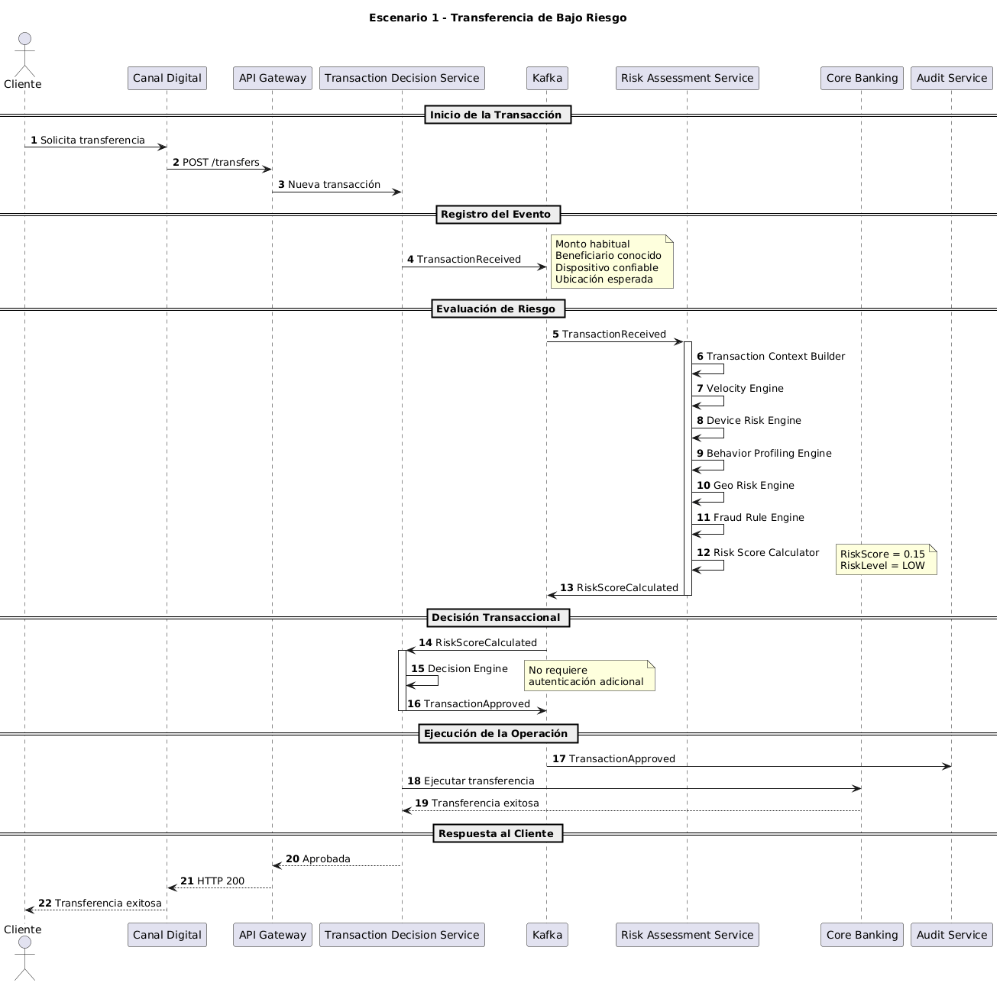

# Escenario 1: Transferencia de Bajo Riesgo

## Objetivo

Validar el comportamiento normal de la plataforma ante una transacción considerada de bajo riesgo, permitiendo una experiencia fluida para el cliente sin solicitar autenticaciones adicionales innecesarias.

---

# Contexto

Un cliente realiza una transferencia desde un dispositivo previamente reconocido, hacia un beneficiario habitual y por un monto consistente con su comportamiento histórico.

La operación no presenta señales relevantes de fraude ni anomalías que justifiquen controles adicionales.

---

# Precondiciones

## Cliente

- Cuenta activa.
- Sin restricciones.
- Sin bloqueos vigentes.

## Dispositivo

- Registrado previamente.
- Reputación confiable.
- Device Trust alto.

## Beneficiario

- Beneficiario conocido.
- Utilizado anteriormente por el cliente.

## Comportamiento

- Monto dentro del comportamiento esperado.
- Frecuencia transaccional normal.
- Sin anomalías geográficas.

---

# Diagrama de Secuencia

El detalle técnico completo del escenario puede consultarse en el siguiente diagrama de secuencia:



---

# Flujo Principal

## Paso 1

El cliente inicia una transferencia desde la aplicación móvil.

```text
Canal Digital
    ↓
Transaction Decision Service
```

---

## Paso 2

El sistema registra la solicitud y publica el evento:

```text
TransactionReceived
```

---

## Paso 3

Risk Assessment Service recibe el evento y evalúa:

- Velocidad transaccional.
- Perfil histórico.
- Dispositivo.
- Ubicación.
- Beneficiario.

---

## Paso 4

El motor de riesgo calcula:

```text
RiskScore = 0.15
RiskLevel = LOW
```

y publica:

```text
RiskScoreCalculated
```

---

## Paso 5

Transaction Decision Service recibe el resultado y valida:

- Riesgo bajo.
- Cuenta activa.
- Ausencia de restricciones.
- Ausencia de bloqueos.

---

## Paso 6

No se requiere autenticación adicional.

La operación es aprobada y se publica:

```text
TransactionApproved
```

---

## Paso 7

Core Bancario ejecuta la transferencia y el cliente recibe confirmación exitosa.

---

# Eventos Generados

## Publicados

```text
TransactionReceived
RiskScoreCalculated
TransactionApproved
```

---

## Consumidos

```text
RiskScoreCalculated
```

---

# Decisiones Tomadas

| Regla | Resultado |
|---------|------------|
| Dispositivo confiable | Cumple |
| Beneficiario conocido | Cumple |
| Velocidad normal | Cumple |
| Ubicación esperada | Cumple |
| Riesgo bajo | Cumple |
| Autenticación adicional requerida | No |

---

# Resultado Esperado

La transacción es aprobada sin requerir autenticación adicional.

El cliente experimenta un flujo rápido, transparente y sin fricción.

---

# Beneficios para el Negocio

| Beneficio para el Negocio | Objetivo Principal | Impacto de la Solución |
| :--- | :--- | :--- |
| **Experiencia de Usuario** | Minimizar la fricción | Se evita introducir autenticaciones innecesarias en operaciones legítimas. |
| **Seguridad** | Mitigación proactiva de fraude | La operación es evaluada por el motor de riesgo antes de ser autorizada. |
| **Eficiencia Operativa** | Uso inteligente de recursos | Los mecanismos de autenticación se utilizan únicamente cuando existe una condición de riesgo que lo justifique. |
| **Optimización de Costos** | Reducción de gasto transaccional | Se reduce el consumo de servicios externos de autenticación para operaciones de bajo riesgo. |

---

# Atributos de Calidad Involucrados

| Atributo de Calidad | Objetivo | Enfoque Arquitectónico |
| :--- | :--- | :--- |
| **Rendimiento** | Baja latencia | La evaluación de riesgo y seguridad ocurre en tiempo real. |
| **Escalabilidad** | Procesamiento desacoplado | La solución mitiga cuellos de botella utilizando una arquitectura basada en eventos. |
| **Auditabilidad** | Registro de decisiones | Todos los eventos y determinaciones quedan guardados de forma inmutable para futuras investigaciones o revisiones regulatorias. |
| **Disponibilidad** | Continuidad operativa | La operación principal del sistema no depende críticamente de proveedores externos de autenticación para completarse. |
---

# Relación con la Arquitectura

## Servicios Participantes

```text
Canal Digital
API Gateway
Transaction Decision Service
Kafka
Risk Assessment Service
Core Banking
Audit Service
```

---

## Componentes Clave

| Componente Clave | Función / Responsabilidad |
| :--- | :--- |
| **Transaction Context Builder** | Construye el contexto necesario para la evaluación de riesgo. |
| **Velocity Engine** | Evalúa patrones de velocidad y frecuencia transaccional. |
| **Fraud Rule Engine** | Aplica reglas de fraude y negocio. |
| **Risk Score Calculator** | Determina el score y nivel de riesgo. |
| **Decision Engine** | Determina la decisión final de la transacción. |
| **Kafka** | Propaga los eventos de dominio entre los diferentes contextos. |
---


Este escenario representa el flujo nominal de la plataforma, donde una operación legítima puede completarse con mínima fricción para el cliente, manteniendo simultáneamente los controles de riesgo, trazabilidad y seguridad requeridos por el negocio.