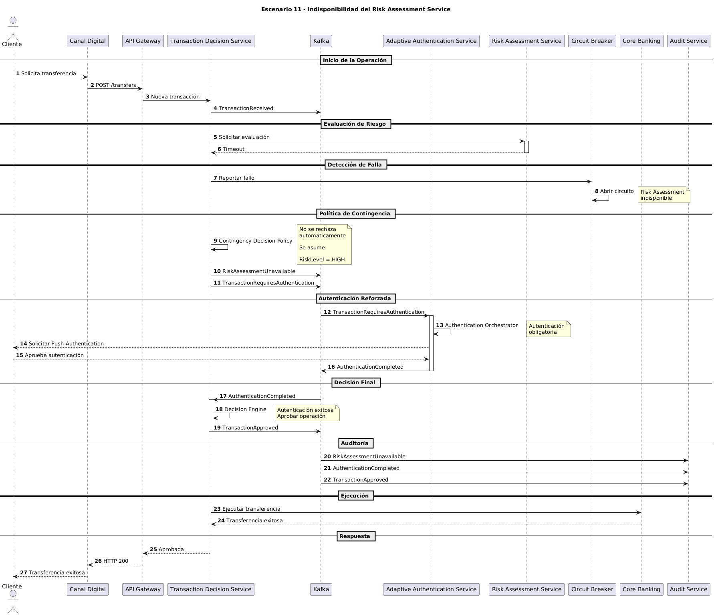

# Escenario 11: Indisponibilidad del Risk Assessment Service

## Objetivo

Validar la capacidad de la plataforma para mantener la continuidad operativa cuando el servicio de evaluación de riesgo no está disponible, aplicando mecanismos de resiliencia y controles compensatorios que permitan reducir el riesgo sin interrumpir completamente la operación.

---

# Contexto

Un cliente legítimo intenta realizar una transferencia mientras el servicio de evaluación de riesgo presenta una indisponibilidad temporal.

Dado que el sistema no puede calcular el nivel de riesgo de forma normal, la plataforma debe adoptar una estrategia de contingencia que mantenga la seguridad y minimice el impacto sobre la experiencia del cliente.

La solución implementa una estrategia de degradación controlada basada en autenticación reforzada.

---

# Precondiciones

## Cliente

- Cuenta activa.
- Sin bloqueos.
- Sin restricciones operativas.

## Infraestructura

- Risk Assessment Service fuera de servicio.
- Adaptive Authentication Service disponible.
- Kafka disponible.
- Core Bancario disponible.

## Arquitectura

- Circuit Breaker habilitado.
- Política de contingencia configurada.

---

# Diagrama de Secuencia

El detalle técnico completo del escenario puede consultarse en el siguiente diagrama de secuencia:



---

# Flujo Principal

## Paso 1

El cliente inicia una transferencia.

```text
Canal Digital
    ↓
Transaction Decision Service
```

---

## Paso 2

Transaction Decision Service intenta solicitar una evaluación de riesgo.

---

## Paso 3

Risk Assessment Service no responde dentro del tiempo esperado.

La solicitud expira mediante:

```text
Timeout
```

---

## Paso 4

Circuit Breaker detecta la falla y abre el circuito para evitar nuevas llamadas al servicio degradado.

---

## Paso 5

Transaction Decision Service activa la política de contingencia.

En lugar de rechazar automáticamente la operación, el sistema asume:

```text
RiskLevel = HIGH
```

---

## Paso 6

Se publica:

```text
RiskAssessmentUnavailable
```

---

## Paso 7

La plataforma solicita autenticación reforzada.

Se publica:

```text
TransactionRequiresAuthentication
```

---

## Paso 8

Adaptive Authentication Service inicia el proceso de autenticación.

Por ejemplo:

```text
Push Authentication
```

---

## Paso 9

El cliente completa exitosamente la autenticación.

Se publica:

```text
AuthenticationCompleted
```

---

## Paso 10

Transaction Decision Service recibe el resultado y aprueba la operación.

Se publica:

```text
TransactionApproved
```

---

## Paso 11

Core Bancario ejecuta la transferencia.

---

## Paso 12

Audit Service registra la indisponibilidad del servicio y todas las decisiones tomadas.

---

# Eventos Generados

## Publicados

```text
TransactionReceived
RiskAssessmentUnavailable
TransactionRequiresAuthentication
AuthenticationCompleted
TransactionApproved
```

---

## Consumidos

```text
TransactionRequiresAuthentication
AuthenticationCompleted
```

---

# Decisiones Tomadas

| Regla | Resultado |
|---------|------------|
| Risk Assessment disponible | No |
| Timeout detectado | Sí |
| Circuit Breaker activado | Sí |
| Riesgo asumido como alto | Sí |
| Autenticación reforzada requerida | Sí |
| Autenticación exitosa | Sí |
| Operación aprobada | Sí |

---

# Resultado Esperado

La transacción puede completarse aun cuando el servicio de evaluación de riesgo no está disponible.

La plataforma compensa la falta de evaluación mediante autenticación reforzada y mantiene la continuidad operativa.

---

# Beneficios para el Negocio

## Continuidad Operativa

La indisponibilidad de un servicio no provoca una interrupción total del negocio.

---

## Protección del Cliente

Se incrementan los controles de seguridad ante la ausencia de información de riesgo.

---

## Resiliencia

La plataforma mantiene capacidad operativa durante fallas parciales.

---

## Reducción del Impacto Operacional

Se evita rechazar automáticamente todas las transacciones legítimas.

---

# Atributos de Calidad Involucrados

## Disponibilidad

La plataforma continúa operando ante la caída de un servicio crítico.

---

## Resiliencia

Se implementan mecanismos de degradación controlada.

---

## Seguridad

La autenticación reforzada compensa la ausencia temporal del análisis de riesgo.

---

## Observabilidad

La indisponibilidad y las decisiones asociadas quedan registradas para monitoreo y auditoría.

---

# Relación con la Arquitectura

## Servicios Participantes

```text
Canal Digital
API Gateway
Transaction Decision Service
Risk Assessment Service
Adaptive Authentication Service
Kafka
Core Banking
Audit Service
```

---

## Componentes Clave

### Circuit Breaker

Detecta la indisponibilidad y evita saturar el servicio degradado.

### Contingency Decision Policy

Define la estrategia de negocio cuando el riesgo no puede ser calculado.

### Authentication Orchestrator

Gestiona el proceso de autenticación reforzada.

### Decision Engine

Determina la decisión final de la operación.

### Audit Service

Registra las condiciones excepcionales y decisiones tomadas.

---

# Patrones Arquitectónicos Demostrados

## Circuit Breaker

Aísla servicios degradados y evita fallas en cascada.

---

## Graceful Degradation

La plataforma reduce funcionalidad manteniendo el servicio disponible.

---

## Fail Safe Strategy

Ante incertidumbre, se incrementan los controles de seguridad.

---

## Event-Driven Architecture

Las decisiones continúan propagándose mediante eventos desacoplados.

---

# Alternativas Consideradas

## Fail Closed

```text
Rechazar todas las transacciones
```

### Ventaja

Máxima seguridad.

### Desventaja

Impacto severo sobre el negocio.

---

## Fail Open

```text
Aprobar todas las transacciones
```

### Ventaja

Máxima disponibilidad.

### Desventaja

Riesgo inaceptable de fraude.

---

## Estrategia Adoptada

```text
Step-Up Authentication
```

La plataforma asume riesgo elevado y exige autenticación reforzada antes de aprobar la operación.

Esta alternativa proporciona el mejor balance entre seguridad y continuidad operativa.

---

# Diferencias respecto al Escenario 4

| Aspecto | Escenario 4 | Escenario 11 |
|----------|------------|------------|
| Servicio afectado | Proveedor OTP | Risk Assessment Service |
| Funcionalidad degradada | Autenticación | Evaluación de riesgo |
| Mecanismo principal | Fallback | Contingencia basada en riesgo |
| Resultado | Cambio de factor | Riesgo asumido + autenticación reforzada |

---

# Conclusión

Este escenario demuestra la capacidad de la plataforma para operar bajo condiciones degradadas sin comprometer la seguridad ni la continuidad del negocio. Mediante el uso de Circuit Breaker, políticas de contingencia y autenticación reforzada, la solución mantiene la capacidad de procesar operaciones legítimas incluso cuando uno de sus servicios más críticos se encuentra temporalmente indisponible.