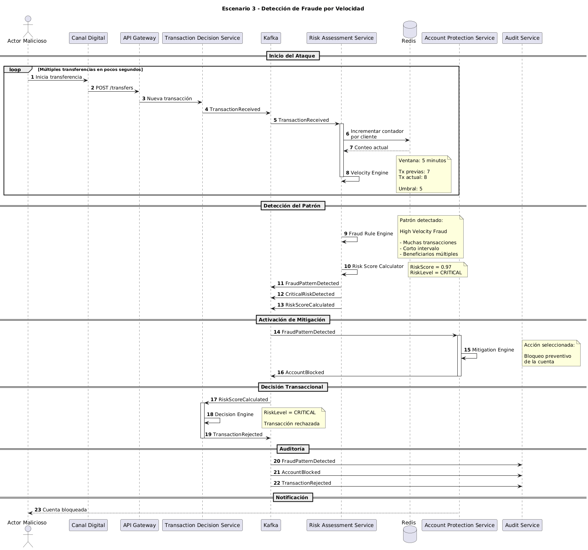

# Escenario 3: Detección de Fraude por Velocidad

## Objetivo

Validar la capacidad de la plataforma para identificar patrones de fraude por velocidad en tiempo real, bloqueando operaciones sospechosas antes de que múltiples transacciones fraudulentas sean completadas exitosamente.

---

# Contexto

Un actor malicioso obtiene acceso a una cuenta legítima e intenta realizar múltiples transferencias en un corto período de tiempo.

Aunque cada transacción individual podría parecer válida, el comportamiento agregado revela un patrón anómalo que debe ser detectado por la plataforma.

La solución debe identificar el comportamiento sospechoso, elevar el nivel de riesgo y ejecutar medidas automáticas de mitigación.

---

# Precondiciones

## Cliente

- Cuenta activa.
- Sin bloqueos previos.
- Sin restricciones operativas.

## Dispositivo

- Puede ser conocido o desconocido.

## Contexto de Fraude

- Múltiples transacciones ejecutadas en pocos minutos.
- Incremento repentino en la frecuencia transaccional.
- Posibles beneficiarios nuevos.
- Comportamiento inconsistente con el perfil histórico.

---

# Diagrama de Secuencia

El detalle técnico completo del escenario puede consultarse en el siguiente diagrama de secuencia:



---

# Flujo Principal

## Paso 1

Un actor malicioso inicia múltiples transferencias en un corto período de tiempo.

```text
Canal Digital
    ↓
Transaction Decision Service
```

---

## Paso 2

Por cada operación recibida, el sistema publica:

```text
TransactionReceived
```

---

## Paso 3

Risk Assessment Service consume los eventos y registra actividad en Redis.

El Velocity Engine analiza:

- Número de transacciones.
- Frecuencia.
- Monto acumulado.
- Beneficiarios involucrados.
- Ventana temporal.

---

## Paso 4

Al superar los umbrales configurados, el Velocity Engine genera señales de riesgo.

El Fraud Rule Engine identifica un patrón de:

```text
High Velocity Fraud
```

---

## Paso 5

El motor de riesgo calcula:

```text
RiskScore = 0.97
RiskLevel = CRITICAL
```

y publica:

```text
FraudPatternDetected
CriticalRiskDetected
RiskScoreCalculated
```

---

## Paso 6

Account Protection Service recibe la alerta de fraude.

La estrategia de mitigación determina:

```text
Bloqueo preventivo de la cuenta
```

y publica:

```text
AccountBlocked
```

---

## Paso 7

Transaction Decision Service recibe el resultado de riesgo.

La transacción es rechazada.

Se publica:

```text
TransactionRejected
```

---

## Paso 8

Audit Service registra todos los eventos para fines de auditoría e investigación.

---

# Eventos Generados

## Publicados

```text
TransactionReceived
FraudPatternDetected
CriticalRiskDetected
RiskScoreCalculated
AccountBlocked
TransactionRejected
```

---

## Consumidos

```text
TransactionReceived
FraudPatternDetected
RiskScoreCalculated
```

---

# Decisiones Tomadas

| Regla | Resultado |
|---------|------------|
| Frecuencia transaccional normal | No |
| Ventana de tiempo aceptable | No |
| Patrón de comportamiento esperado | No |
| Riesgo crítico | Sí |
| Requiere mitigación automática | Sí |
| Bloqueo preventivo | Sí |
| Transacción aprobada | No |

---

# Resultado Esperado

La plataforma detecta el patrón de fraude antes de que continúe la actividad sospechosa.

Las transacciones posteriores son rechazadas y la cuenta es bloqueada preventivamente.

---

# Beneficios para el Negocio

| Beneficio para el Negocio | Objetivo Principal | Impacto de la Solución |
| :--- | :--- | :--- |
| **Reducción de Pérdidas Financieras** | Control de impacto | La detección temprana evita que múltiples transacciones fraudulentas sean ejecutadas de forma consecutiva. |
| **Protección del Cliente** | Resguardo de identidad | Se limita el impacto económico de una posible apropiación de cuenta (*Account Takeover*). |
| **Respuesta Automatizada** | Eficiencia operativa | La mitigación del riesgo y la aplicación de bloqueos ocurren de manera inmediata sin requerir intervención manual. |
| **Cumplimiento Regulatorio** | Alineación legal | La organización puede demostrar ante entes de control que posee mecanismos efectivos de prevención de fraude. |
---

# Atributos de Calidad Involucrados

| Atributo de Calidad / Pilar | Objetivo Principal | Enfoque Arquitectónico |
| :--- | :--- | :--- |
| **Seguridad** | Control de riesgo | Detección activa de comportamientos anómalos dentro del flujo transaccional. |
| **Rendimiento** | Baja latencia | La evaluación y el procesamiento de las reglas ocurren en tiempo real. |
| **Escalabilidad** | Alta concurrencia | El uso de Redis permite manejar grandes volúmenes de eventos e información concurrente. |
| **Resiliencia** | Tolerancia a fallos | La detección y la mitigación operan de forma desacoplada de los servicios core mediante eventos. |
| **Auditabilidad** | Trazabilidad completa | Todas las decisiones y evaluaciones quedan registradas para una investigación o auditoría posterior. |

---

# Relación con la Arquitectura

## Servicios Participantes

```text
Canal Digital
API Gateway
Transaction Decision Service
Kafka
Risk Assessment Service
Redis
Account Protection Service
Audit Service
```

---

## Componentes Clave

| Componente Clave | Función / Responsabilidad |
| :--- | :--- |
| **Velocity Engine** | Analiza patrones de velocidad transaccional. |
| **Fraud Rule Engine** | Identifica comportamientos sospechosos. |
| **Risk Score Calculator** | Determina el nivel de riesgo. |
| **Mitigation Engine** | Ejecuta acciones automáticas de protección. |
| **Kafka** | Distribuye eventos de riesgo y mitigación. |
| **Redis** | Mantiene contadores y ventanas temporales para detección en tiempo real. |

---

# Diferencias respecto al Escenario 1

| Aspecto | Escenario 1 | Escenario 3 |
|----------|------------|------------|
| Frecuencia transaccional | Normal | Anómala |
| Riesgo | LOW | CRITICAL |
| Autenticación adicional | No | No aplica |
| Bloqueo de cuenta | No | Sí |
| Resultado | Aprobada | Rechazada |
| Mitigación automática | No | Sí |

---

# Diferencias respecto al Escenario 2

| Aspecto | Escenario 2 | Escenario 3 |
|----------|------------|------------|
| Riesgo | HIGH | CRITICAL |
| Causa principal | Dispositivo nuevo | Fraude por velocidad |
| Acción | Autenticación adaptativa | Bloqueo preventivo |
| Resultado | Aprobada tras autenticación | Rechazada |

---


Este escenario representa el principal mecanismo de defensa de la plataforma frente a ataques automatizados o apropiaciones de cuenta. Mediante la combinación de Kafka, Redis y el motor de evaluación de riesgo, la solución es capaz de identificar patrones de fraude por velocidad en tiempo real, ejecutar medidas automáticas de mitigación y reducir significativamente la probabilidad de pérdidas financieras.