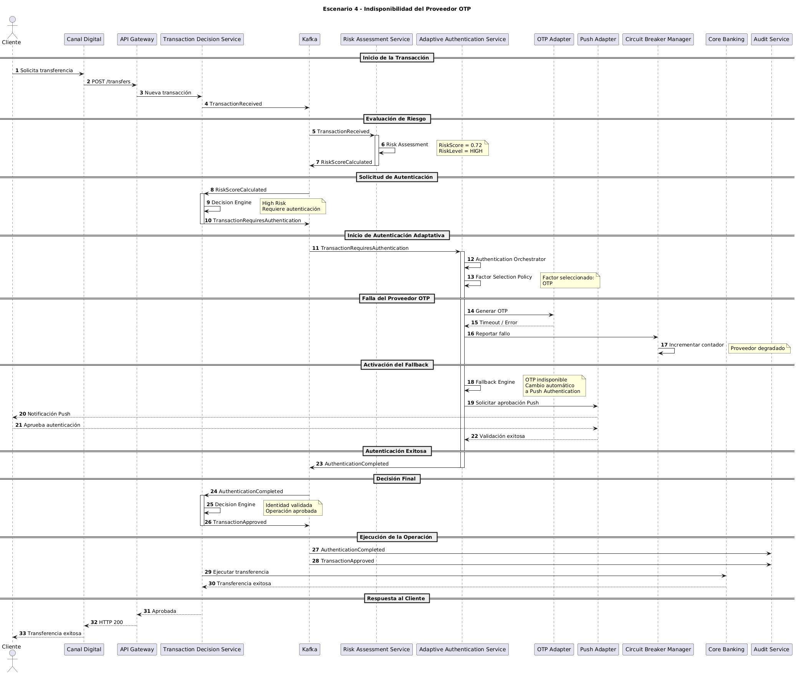

# Escenario 4: Indisponibilidad del Proveedor OTP

## Objetivo

Validar la capacidad de la plataforma para mantener la continuidad operativa cuando el proveedor de OTP presenta una indisponibilidad, utilizando mecanismos de autenticación alternativos sin comprometer la seguridad ni la experiencia del cliente.

---

# Contexto

Un cliente realiza una transacción que requiere autenticación adicional debido a su nivel de riesgo.

La política de autenticación determina inicialmente que el factor más adecuado es OTP. Sin embargo, durante la ejecución del proceso el proveedor OTP presenta una falla o indisponibilidad.

La plataforma debe detectar la situación, activar mecanismos de resiliencia y continuar el proceso utilizando factores alternativos de autenticación.

---

# Precondiciones

## Cliente

- Cuenta activa.
- Sin bloqueos.
- Sin restricciones operativas.

## Transacción

- Riesgo elevado.
- Requiere autenticación adicional.

## Infraestructura

- Proveedor OTP degradado o fuera de servicio.
- Proveedor Push disponible.
- Circuit Breaker habilitado.

---

# Diagrama de Secuencia

El detalle técnico completo del escenario puede consultarse en el siguiente diagrama de secuencia:



---

# Flujo Principal

## Paso 1

El cliente inicia una transferencia.

```text
Canal Digital
    ↓
Transaction Decision Service
```

---

## Paso 2

La transacción es evaluada por el motor de riesgo.

El resultado indica:

```text
RiskScore = 0.72
RiskLevel = HIGH
```

---

## Paso 3

Transaction Decision Service determina que la operación requiere autenticación adicional.

Se publica:

```text
TransactionRequiresAuthentication
```

---

## Paso 4

Adaptive Authentication Service recibe la solicitud.

La política de autenticación selecciona inicialmente:

```text
OTP
```

como factor de autenticación.

---

## Paso 5

El OTP Adapter intenta comunicarse con el proveedor externo.

La solicitud falla debido a:

```text
Timeout
```

o

```text
Servicio no disponible
```

---

## Paso 6

Circuit Breaker Manager registra el fallo y marca al proveedor como degradado.

---

## Paso 7

Fallback Engine identifica que OTP no está disponible y selecciona automáticamente un mecanismo alternativo.

Por ejemplo:

```text
Push Authentication
```

---

## Paso 8

El cliente recibe una notificación Push y aprueba la autenticación.

Se publica:

```text
AuthenticationCompleted
```

---

## Paso 9

Transaction Decision Service recibe el resultado exitoso de autenticación.

La transacción es aprobada.

Se publica:

```text
TransactionApproved
```

---

## Paso 10

Core Bancario ejecuta la transferencia y el cliente recibe confirmación exitosa.

---

# Eventos Generados

## Publicados

```text
TransactionReceived
RiskScoreCalculated
TransactionRequiresAuthentication
AuthenticationCompleted
TransactionApproved
```

---

## Consumidos

```text
TransactionRequiresAuthentication
AuthenticationCompleted
```

---

# Decisiones Tomadas

| Regla | Resultado |
|---------|------------|
| Riesgo alto | Sí |
| Requiere autenticación | Sí |
| OTP disponible | No |
| Activar Circuit Breaker | Sí |
| Aplicar Fallback | Sí |
| Push disponible | Sí |
| Autenticación exitosa | Sí |
| Operación aprobada | Sí |

---

# Resultado Esperado

La transacción es completada exitosamente utilizando un mecanismo alternativo de autenticación.

La indisponibilidad del proveedor OTP no afecta la continuidad del negocio.

---

# Beneficios para el Negocio

## Continuidad Operativa

La caída de un proveedor externo no impide la ejecución de operaciones legítimas.

---

## Experiencia de Usuario

El cliente puede completar la operación sin interrupciones significativas.

---

## Resiliencia

La plataforma mantiene capacidad operativa ante fallos parciales.

---

## Independencia Tecnológica

La lógica de autenticación no depende de un único proveedor.

---

# Atributos de Calidad Involucrados

## Disponibilidad

La plataforma continúa operando aun cuando un proveedor externo falla.

---

## Resiliencia

Los mecanismos de fallback permiten degradación controlada del servicio.

---

## Seguridad

La autenticación continúa siendo obligatoria a pesar del fallo del proveedor inicial.

---

## Observabilidad

Los fallos son registrados y monitoreados mediante métricas y trazabilidad distribuida.

---

# Relación con la Arquitectura

## Servicios Participantes

```text
Canal Digital
API Gateway
Transaction Decision Service
Kafka
Risk Assessment Service
Adaptive Authentication Service
Core Banking
Audit Service
```

---

## Componentes Clave

### Authentication Orchestrator

Coordina el proceso completo de autenticación.

### Factor Selection Policy

Selecciona el factor más apropiado para cada contexto.

### OTP Adapter

Gestiona la integración con el proveedor OTP.

### Circuit Breaker Manager

Detecta y aísla proveedores degradados.

### Fallback Engine

Selecciona mecanismos alternativos de autenticación.

### Push Adapter

Permite continuar el proceso mediante autenticación Push.

---

# Diferencias respecto al Escenario 2

| Aspecto | Escenario 2 | Escenario 4 |
|----------|------------|------------|
| Dispositivo nuevo | Sí | No necesariamente |
| Riesgo | HIGH | HIGH |
| OTP disponible | Sí | No |
| Fallback requerido | No | Sí |
| Circuit Breaker | No | Sí |
| Objetivo principal | Validar identidad | Garantizar continuidad operativa |

---

# Patrones Arquitectónicos Demostrados

## Circuit Breaker

Evita llamadas repetitivas a un proveedor degradado.

---

## Fallback Pattern

Permite utilizar mecanismos alternativos cuando el principal no está disponible.

---

## Anti-Corruption Layer

Los adaptadores aíslan a la plataforma de cambios o fallos de proveedores externos.

---

## Event-Driven Architecture

La comunicación entre servicios continúa desacoplada mediante eventos.

---

Este escenario demuestra la capacidad de la plataforma para mantener la continuidad operativa ante la indisponibilidad de un proveedor externo de autenticación. Mediante el uso de Circuit Breaker, Fallback Pattern y autenticación adaptativa, la solución garantiza que las operaciones legítimas puedan completarse de forma segura sin depender de un único proveedor tecnológico.