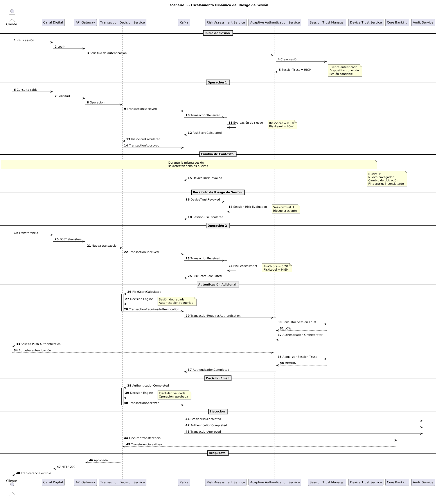

# Escenario 5: Escalamiento Dinámico del Riesgo de Sesión

## Objetivo

Validar la capacidad de la plataforma para monitorear continuamente el riesgo asociado a una sesión activa y aplicar controles de seguridad adicionales cuando el contexto de la sesión cambia de forma significativa.

---

# Contexto

Un cliente inicia sesión exitosamente desde un dispositivo confiable y realiza operaciones de bajo riesgo sin inconvenientes.

Posteriormente, durante la misma sesión, se detectan señales anómalas que incrementan el riesgo:

- Cambio de dirección IP.
- Cambio de ubicación geográfica.
- Cambio de navegador.
- Variación del fingerprint del dispositivo.
- Pérdida de confianza del dispositivo.

La plataforma debe identificar este cambio de contexto, recalcular el riesgo de la sesión y exigir autenticación adicional antes de permitir operaciones sensibles.

---

# Precondiciones

## Cliente

- Cuenta activa.
- Sin bloqueos.
- Sin restricciones operativas.

## Dispositivo

- Inicialmente registrado y confiable.
- Device Trust alto al inicio de la sesión.

## Sesión

- Sesión autenticada exitosamente.
- Session Trust inicial alto.

---

# Diagrama de Secuencia

El detalle técnico completo del escenario puede consultarse en el siguiente diagrama de secuencia:



---

# Flujo Principal

## Paso 1

El cliente inicia sesión exitosamente desde un dispositivo conocido.

El sistema establece:

```text
SessionTrust = HIGH
```

---

## Paso 2

El cliente realiza una operación de bajo riesgo.

El motor de riesgo determina:

```text
RiskScore = 0.10
RiskLevel = LOW
```

La operación es aprobada sin requerir autenticación adicional.

---

## Paso 3

Durante la sesión se detectan nuevas señales de riesgo.

Por ejemplo:

- Cambio de IP.
- Cambio de ubicación.
- Cambio de navegador.
- Inconsistencia en el fingerprint del dispositivo.

---

## Paso 4

Device Trust Service publica:

```text
DeviceTrustRevoked
```

indicando una reducción en la confianza del dispositivo.

---

## Paso 5

Risk Assessment Service recibe el evento y recalcula el riesgo de la sesión.

Se publica:

```text
SessionRiskEscalated
```

---

## Paso 6

El cliente intenta realizar una transferencia.

La nueva evaluación de riesgo determina:

```text
RiskScore = 0.78
RiskLevel = HIGH
```

---

## Paso 7

Transaction Decision Service determina que la operación requiere autenticación adicional.

Se publica:

```text
TransactionRequiresAuthentication
```

---

## Paso 8

Adaptive Authentication Service consulta el nivel de confianza de la sesión.

```text
SessionTrust = LOW
```

---

## Paso 9

Se solicita autenticación adaptativa.

Por ejemplo:

```text
Push Authentication
```

---

## Paso 10

El cliente completa exitosamente la autenticación.

Se publica:

```text
AuthenticationCompleted
```

---

## Paso 11

Session Trust Manager actualiza el nivel de confianza.

```text
SessionTrust = MEDIUM
```

---

## Paso 12

Transaction Decision Service aprueba la operación.

Se publica:

```text
TransactionApproved
```

---

## Paso 13

Core Bancario ejecuta la transferencia y el cliente recibe confirmación exitosa.

---

# Eventos Generados

## Publicados

```text
TransactionReceived
DeviceTrustRevoked
SessionRiskEscalated
RiskScoreCalculated
TransactionRequiresAuthentication
AuthenticationCompleted
TransactionApproved
```

---

## Consumidos

```text
DeviceTrustRevoked
SessionRiskEscalated
RiskScoreCalculated
AuthenticationCompleted
```

---

# Decisiones Tomadas

| Regla | Resultado |
|---------|------------|
| Dispositivo inicialmente confiable | Sí |
| Cambio de contexto detectado | Sí |
| Session Trust degradado | Sí |
| Riesgo elevado | Sí |
| Autenticación adicional requerida | Sí |
| Autenticación exitosa | Sí |
| Operación aprobada | Sí |

---

# Resultado Esperado

La plataforma detecta el cambio de contexto durante una sesión activa y exige autenticación adicional antes de permitir operaciones sensibles.

La operación solo es aprobada después de validar nuevamente la identidad del cliente.

---

# Beneficios para el Negocio

## Protección Contra Apropiación de Sesiones

Reduce el riesgo asociado a ataques de Session Hijacking.

---

## Protección Contra Account Takeover

Permite identificar comportamientos incompatibles con el contexto original de la sesión.

---

## Seguridad Adaptativa

Los controles de seguridad evolucionan dinámicamente según el comportamiento observado.

---

## Mejor Experiencia de Usuario

La autenticación adicional solo se solicita cuando existe evidencia de incremento de riesgo.

---

# Atributos de Calidad Involucrados

## Seguridad

Monitoreo continuo del contexto de la sesión.

---

## Resiliencia

La plataforma puede responder dinámicamente a cambios de riesgo sin interrumpir el servicio.

---

## Auditabilidad

Todos los cambios de riesgo y decisiones quedan registrados.

---

## Escalabilidad

La evaluación continua se realiza mediante eventos desacoplados.

---

# Relación con la Arquitectura

## Servicios Participantes

```text
Canal Digital
API Gateway
Transaction Decision Service
Kafka
Risk Assessment Service
Adaptive Authentication Service
Device Trust Service
Core Banking
Audit Service
```

---

## Componentes Clave

### Session Trust Manager

Gestiona el nivel de confianza de la sesión.

### Device Risk Engine

Evalúa señales relacionadas con el dispositivo.

### Risk Score Calculator

Determina el nivel de riesgo actualizado.

### Authentication Orchestrator

Coordina la autenticación adaptativa.

### Decision Engine

Determina si la operación puede continuar.

### Kafka

Distribuye eventos relacionados con el cambio de contexto.

---

# Diferencias respecto al Escenario 2

| Aspecto | Escenario 2 | Escenario 5 |
|----------|------------|------------|
| Momento del riesgo | Inicio de la operación | Durante una sesión activa |
| Dispositivo | Nuevo | Inicialmente confiable |
| Session Trust | No existe previamente | Se degrada dinámicamente |
| Riesgo | Estático | Dinámico |
| Objetivo principal | Validar dispositivo | Validar contexto de sesión |

---

# Patrones Arquitectónicos Demostrados

## Continuous Risk Assessment

El riesgo se recalcula continuamente durante la vida de la sesión.

---

## Adaptive Authentication

Los mecanismos de autenticación se activan únicamente cuando el contexto lo requiere.

---

## Event-Driven Architecture

Los cambios de contexto se propagan mediante eventos.

---

## Context-Aware Security

Las decisiones de seguridad consideran el comportamiento actual y no únicamente la autenticación inicial.

---


Este escenario demuestra que la plataforma no considera la autenticación como un evento único realizado al inicio de la sesión. Por el contrario, monitorea continuamente el contexto del usuario y ajusta dinámicamente el nivel de riesgo. Cuando se detectan señales incompatibles con el comportamiento esperado, la solución incrementa los controles de seguridad, solicita autenticación adicional y protege la operación sin afectar innecesariamente la experiencia de los usuarios legítimos.