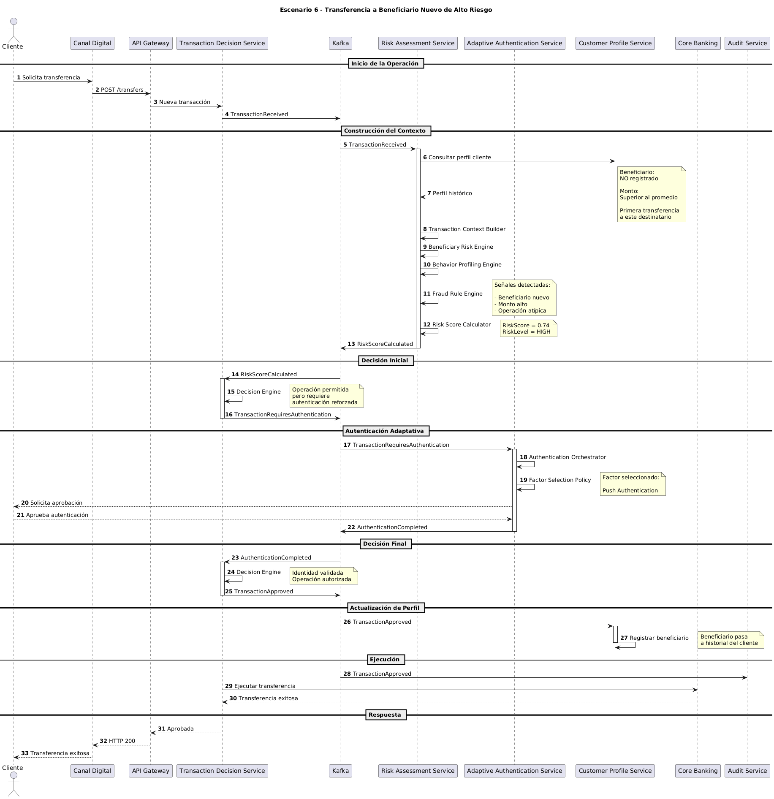

# Escenario 6: Transferencia hacia un Beneficiario Nuevo de Alto Riesgo

## Objetivo

Validar la capacidad de la plataforma para identificar operaciones dirigidas a beneficiarios nuevos y aplicar controles de seguridad adicionales cuando la transacción presenta características de riesgo superiores al comportamiento habitual del cliente.

---

# Contexto

Un cliente legítimo intenta realizar una transferencia hacia un beneficiario que nunca ha utilizado anteriormente.

Aunque el cliente opera desde un dispositivo confiable y una ubicación habitual, el monto de la transferencia es significativamente superior a sus patrones históricos y el destinatario no posee historial previo dentro de la relación transaccional del cliente.

La plataforma debe incrementar dinámicamente el nivel de riesgo y exigir una validación adicional de identidad antes de permitir la operación.

---

# Precondiciones

## Cliente

- Cuenta activa.
- Sin bloqueos.
- Sin restricciones operativas.

## Dispositivo

- Registrado previamente.
- Device Trust alto.

## Beneficiario

- No existe historial previo.
- Primera transferencia hacia este destinatario.

## Contexto Transaccional

- Monto superior al promedio histórico.
- Operación atípica para el cliente.
- Ubicación habitual.

---

# Diagrama de Secuencia

El detalle técnico completo del escenario puede consultarse en el siguiente diagrama de secuencia:



---

# Flujo Principal

## Paso 1

El cliente inicia una transferencia hacia un beneficiario nuevo.

```text
Canal Digital
    ↓
Transaction Decision Service
```

---

## Paso 2

El sistema registra la solicitud y publica:

```text
TransactionReceived
```

---

## Paso 3

Risk Assessment Service construye el contexto transaccional y consulta el historial del cliente.

Durante la evaluación identifica:

- Beneficiario nuevo.
- Monto superior al promedio histórico.
- Operación poco frecuente.

---

## Paso 4

Beneficiary Risk Engine y Behavior Profiling Engine generan señales de riesgo adicionales.

El motor de riesgo calcula:

```text
RiskScore = 0.74
RiskLevel = HIGH
```

y publica:

```text
RiskScoreCalculated
```

---

## Paso 5

Transaction Decision Service recibe el resultado y determina que la operación requiere autenticación reforzada.

Se publica:

```text
TransactionRequiresAuthentication
```

---

## Paso 6

Adaptive Authentication Service inicia el proceso de autenticación adaptativa.

La política selecciona:

```text
Push Authentication
```

como factor de autenticación.

---

## Paso 7

El cliente aprueba exitosamente la autenticación.

Se publica:

```text
AuthenticationCompleted
```

---

## Paso 8

Transaction Decision Service valida el resultado y aprueba la operación.

Se publica:

```text
TransactionApproved
```

---

## Paso 9

Core Bancario ejecuta la transferencia.

---

## Paso 10

Customer Profile Service actualiza el historial del cliente incorporando el nuevo beneficiario.

---

# Eventos Generados

## Publicados

```text
TransactionReceived
RiskScoreCalculated
TransactionRequiresAuthentication
AuthenticationCompleted
TransactionApproved
```

---

## Consumidos

```text
TransactionReceived
RiskScoreCalculated
TransactionRequiresAuthentication
AuthenticationCompleted
TransactionApproved
```

---

# Decisiones Tomadas

| Regla | Resultado |
|---------|------------|
| Beneficiario conocido | No |
| Dispositivo confiable | Sí |
| Ubicación habitual | Sí |
| Monto habitual | No |
| Riesgo alto | Sí |
| Requiere autenticación adaptativa | Sí |
| Autenticación exitosa | Sí |
| Operación aprobada | Sí |

---

# Resultado Esperado

La operación es aprobada únicamente después de validar exitosamente la identidad del cliente mediante autenticación adaptativa.

El nuevo beneficiario queda registrado para futuras evaluaciones de riesgo.

---

# Beneficios para el Negocio

## Prevención de Fraude

Reduce el riesgo asociado a transferencias hacia cuentas desconocidas o potencialmente fraudulentas.

---

## Protección contra Account Takeover

Evita que un atacante transfiera fondos inmediatamente hacia cuentas externas sin controles adicionales.

---

## Seguridad Adaptativa

Incrementa los controles únicamente cuando existen señales relevantes de riesgo.

---

## Aprendizaje Continuo

El historial del cliente evoluciona y mejora futuras evaluaciones.

---

# Atributos de Calidad Involucrados

## Seguridad

La operación es sometida a controles adicionales debido al incremento del riesgo.

---

## Auditabilidad

Las decisiones y eventos quedan registrados para análisis posterior.

---

## Escalabilidad

La evaluación de riesgo y autenticación operan de forma desacoplada mediante eventos.

---

## Experiencia de Usuario

La autenticación adicional se solicita únicamente cuando el contexto lo justifica.

---

# Relación con la Arquitectura

## Servicios Participantes

```text
Canal Digital
API Gateway
Transaction Decision Service
Kafka
Risk Assessment Service
Adaptive Authentication Service
Customer Profile Service
Core Banking
Audit Service
```

---

## Componentes Clave

### Beneficiary Risk Engine

Evalúa el nivel de confianza asociado al beneficiario.

### Behavior Profiling Engine

Compara la operación contra patrones históricos.

### Risk Score Calculator

Determina el nivel de riesgo de la transacción.

### Authentication Orchestrator

Gestiona la autenticación adaptativa.

### Customer Profile Service

Mantiene el historial transaccional del cliente.

### Kafka

Propaga eventos de dominio entre los distintos contextos.

---

# Diferencias respecto al Escenario 1

| Aspecto | Escenario 1 | Escenario 6 |
|----------|------------|------------|
| Beneficiario | Conocido | Nuevo |
| Riesgo | LOW | HIGH |
| Autenticación adicional | No | Sí |
| Monto | Habitual | Superior al promedio |
| Resultado | Aprobada directamente | Aprobada tras autenticación |

---

# Diferencias respecto al Escenario 2

| Aspecto | Escenario 2 | Escenario 6 |
|----------|------------|------------|
| Señal principal de riesgo | Dispositivo nuevo | Beneficiario nuevo |
| Device Trust | Bajo o desconocido | Alto |
| Riesgo | HIGH | HIGH |
| Control aplicado | Autenticación adaptativa | Autenticación adaptativa |

---


Este escenario demuestra la capacidad de la plataforma para evaluar el riesgo asociado a beneficiarios nuevos y aplicar controles adaptativos cuando la operación presenta características inusuales para el cliente. La combinación de análisis contextual, autenticación adaptativa y actualización continua del perfil del cliente permite reducir significativamente el riesgo de fraude sin afectar innecesariamente la experiencia de usuarios legítimos.