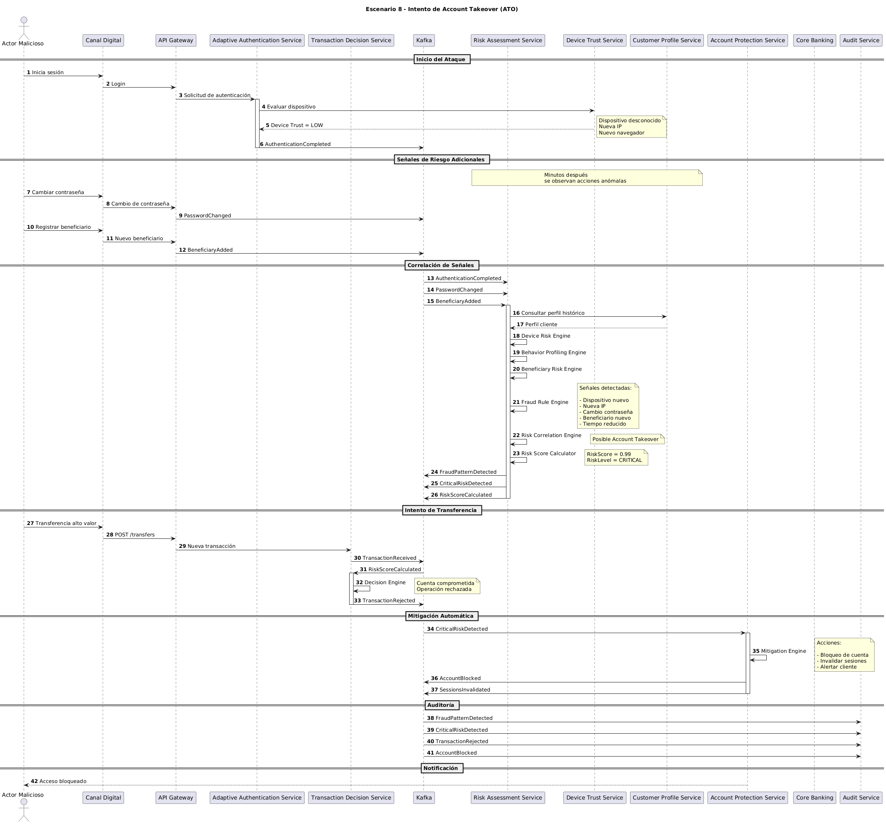

# Escenario 8: Intento de Account Takeover (ATO)

## Objetivo

Validar la capacidad de la plataforma para detectar intentos de apropiación de cuenta (Account Takeover) mediante la correlación de múltiples señales de riesgo distribuidas a lo largo de una sesión, ejecutando acciones automáticas de mitigación antes de que una transacción fraudulenta sea completada.

---

# Contexto

Un actor malicioso obtiene acceso a las credenciales de un cliente legítimo e inicia sesión desde un entorno diferente al habitual.

Aunque la autenticación inicial es exitosa, durante la sesión se generan múltiples eventos sospechosos que, al ser analizados en conjunto, indican una alta probabilidad de compromiso de cuenta.

La plataforma debe detectar el patrón, bloquear la operación y proteger la cuenta antes de que se produzca una pérdida financiera.

---

# Precondiciones

## Cliente

- Cuenta activa.
- Sin bloqueos previos.
- Historial transaccional conocido.

## Atacante

- Posee credenciales válidas.
- Utiliza un dispositivo diferente al habitual.
- Opera desde una ubicación no reconocida.

## Contexto de Riesgo

- Nuevo dispositivo.
- Nueva dirección IP.
- Cambio reciente de contraseña.
- Registro de beneficiario nuevo.
- Transferencia de alto valor.

---

# Diagrama de Secuencia

El detalle técnico completo del escenario puede consultarse en el siguiente diagrama de secuencia:



---

# Flujo Principal

## Paso 1

El atacante inicia sesión utilizando credenciales válidas.

Durante la autenticación se detectan señales iniciales:

- Dispositivo desconocido.
- Nueva dirección IP.
- Navegador no registrado.

---

## Paso 2

La autenticación es completada.

Se publica:

```text
AuthenticationCompleted
```

---

## Paso 3

Durante la misma sesión el atacante realiza acciones inusuales.

Por ejemplo:

### Cambio de contraseña

```text
PasswordChanged
```

---

### Registro de un nuevo beneficiario

```text
BeneficiaryAdded
```

---

## Paso 4

Risk Assessment Service consume los eventos generados y construye el contexto completo de riesgo.

El sistema analiza:

- Riesgo del dispositivo.
- Riesgo del beneficiario.
- Comportamiento histórico.
- Secuencia temporal de eventos.

---

## Paso 5

Risk Correlation Engine identifica una combinación de señales consistente con un intento de apropiación de cuenta.

```text
Account Takeover Pattern
```

---

## Paso 6

El motor de riesgo calcula:

```text
RiskScore = 0.99
RiskLevel = CRITICAL
```

y publica:

```text
FraudPatternDetected
CriticalRiskDetected
RiskScoreCalculated
```

---

## Paso 7

El atacante intenta realizar una transferencia de alto valor.

La transacción es recibida por:

```text
Transaction Decision Service
```

---

## Paso 8

Transaction Decision Service consulta el resultado de riesgo.

La operación es rechazada.

Se publica:

```text
TransactionRejected
```

---

## Paso 9

Account Protection Service recibe la alerta crítica.

La estrategia de mitigación determina:

```text
Bloqueo preventivo de la cuenta
```

---

## Paso 10

La plataforma ejecuta acciones automáticas:

```text
AccountBlocked
SessionsInvalidated
```

---

## Paso 11

Audit Service registra todos los eventos para futuras investigaciones.

---

# Eventos Generados

## Publicados

```text
AuthenticationCompleted
PasswordChanged
BeneficiaryAdded
FraudPatternDetected
CriticalRiskDetected
RiskScoreCalculated
TransactionRejected
AccountBlocked
SessionsInvalidated
```

---

## Consumidos

```text
AuthenticationCompleted
PasswordChanged
BeneficiaryAdded
CriticalRiskDetected
RiskScoreCalculated
```

---

# Decisiones Tomadas

| Regla | Resultado |
|---------|------------|
| Dispositivo conocido | No |
| Dirección IP habitual | No |
| Beneficiario conocido | No |
| Cambio reciente de contraseña | Sí |
| Correlación de señales sospechosas | Sí |
| Riesgo crítico | Sí |
| Bloqueo preventivo requerido | Sí |
| Transferencia aprobada | No |

---

# Resultado Esperado

La plataforma identifica el intento de apropiación de cuenta antes de que la transferencia sea ejecutada.

La cuenta es protegida automáticamente y las sesiones activas son invalidadas.

---

# Beneficios para el Negocio

## Protección Financiera

Reduce significativamente el riesgo de pérdidas económicas asociadas a cuentas comprometidas.

---

## Prevención de Fraude

La detección se basa en correlación de señales y no únicamente en eventos individuales.

---

## Respuesta Automatizada

No requiere intervención manual para ejecutar las medidas de protección.

---

## Protección de Clientes

Disminuye el impacto de credenciales comprometidas.

---

# Atributos de Calidad Involucrados

## Seguridad

Correlación avanzada de señales de fraude.

---

## Resiliencia

La mitigación opera de forma automática y desacoplada.

---

## Auditabilidad

Todos los eventos y decisiones quedan registrados.

---

## Escalabilidad

Los análisis se ejecutan mediante eventos distribuidos.

---

# Relación con la Arquitectura

## Servicios Participantes

```text
Canal Digital
API Gateway
Adaptive Authentication Service
Transaction Decision Service
Kafka
Risk Assessment Service
Device Trust Service
Customer Profile Service
Account Protection Service
Audit Service
```

---

## Componentes Clave

### Device Risk Engine

Evalúa señales relacionadas con dispositivos.

### Behavior Profiling Engine

Compara acciones contra el comportamiento esperado.

### Beneficiary Risk Engine

Evalúa el riesgo asociado a beneficiarios nuevos.

### Risk Correlation Engine

Correlaciona múltiples señales para identificar patrones complejos de fraude.

### Risk Score Calculator

Determina el nivel de riesgo global.

### Mitigation Engine

Ejecuta acciones automáticas de protección.

### Kafka

Distribuye eventos entre dominios desacoplados.

---

# Señales Correlacionadas

La detección no depende de una única señal.

El patrón identificado corresponde a la combinación de:

```text
Dispositivo nuevo
+
Nueva IP
+
Cambio de contraseña
+
Beneficiario nuevo
+
Transferencia de alto valor
```

---

# Patrones Arquitectónicos Demostrados

## Continuous Risk Assessment

El riesgo se evalúa continuamente durante la sesión.

---

## Event-Driven Architecture

Las señales se correlacionan mediante eventos distribuidos.

---

## Signal Correlation

La decisión se basa en la combinación de múltiples indicadores.

---

## Automated Mitigation

La protección se ejecuta automáticamente al superar los umbrales de riesgo.

---

# Diferencias respecto al Escenario 3

| Aspecto | Escenario 3 | Escenario 8 |
|----------|------------|------------|
| Tipo de fraude | Fraude por velocidad | Account Takeover |
| Señal principal | Frecuencia transaccional | Correlación de señales |
| Beneficiario nuevo | Opcional | Sí |
| Cambio de contraseña | No | Sí |
| Invalidación de sesiones | No | Sí |
| Bloqueo de cuenta | Sí | Sí |

---

# Conclusión

Este escenario representa uno de los casos de fraude más relevantes en banca digital moderna. Mediante la correlación de múltiples señales de riesgo distribuidas a lo largo de una sesión, la plataforma es capaz de identificar intentos de apropiación de cuenta antes de que se materialice una pérdida financiera. La combinación de evaluación continua de riesgo, correlación de eventos y mitigación automática proporciona una defensa efectiva contra ataques avanzados de fraude digital.