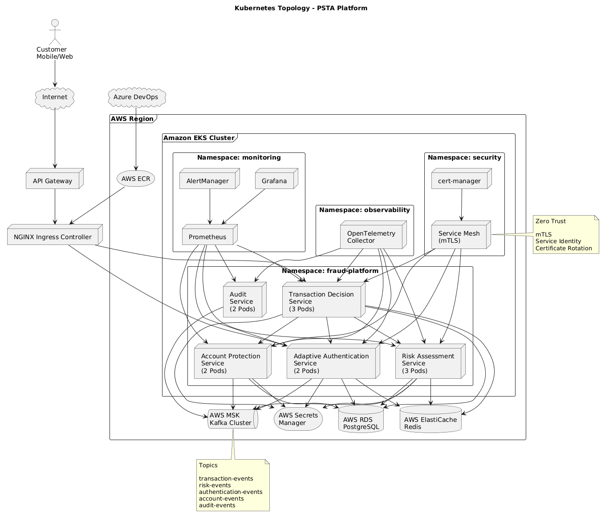

# Topología Kubernetes

## Propósito

Este documento describe la topología Kubernetes propuesta para la Plataforma de Seguridad Transaccional Adaptativa (PSTA).

El objetivo es proporcionar una plataforma de ejecución:

- Escalable.
- Resiliente.
- Segura.
- Observable.
- Preparada para crecimiento futuro.

La solución se implementará sobre:

```text
AWS EKS
(Amazon Elastic Kubernetes Service)
```

siguiendo principios Cloud Native y alineándose con la arquitectura de microservicios definida para la plataforma.

---

# Objetivos Arquitectónicos

La topología debe garantizar:

- Alta disponibilidad.
- Escalabilidad horizontal.
- Aislamiento de cargas.
- Observabilidad centralizada.
- Despliegues continuos.
- Recuperación automática ante fallos.
- Seguridad Zero Trust.

---

# Vista General



La plataforma se despliega sobre un clúster EKS distribuido en múltiples Availability Zones.

```text
                    AWS Region

       ┌───────────────────────────────────┐
       │            AWS EKS                │
       └───────────────────────────────────┘

                 /      |      \

            AZ-A      AZ-B     AZ-C

              │         │        │

         Worker     Worker    Worker
          Nodes      Nodes     Nodes

              │         │        │

         Microservices Platform
```

---

# Arquitectura Física

## Región

La plataforma opera inicialmente en:

```text
Primary Region
```

Ejemplo:

```text
us-east-1
```

o

```text
sa-east-1
```

según estrategia corporativa.

---

## Availability Zones

El clúster utiliza:

```text
AZ-A
AZ-B
AZ-C
```

para eliminar puntos únicos de falla.

---

## Beneficio

La caída completa de una zona no genera indisponibilidad de la plataforma.

---

# AWS EKS

EKS es el plano de control administrado por AWS.

Responsabilidades:

```text
API Server
Scheduler
Controller Manager
ETCD
```

AWS administra:

```text
Patching
Alta Disponibilidad
Actualizaciones
```

---

# Node Groups

La solución utiliza Node Groups separados por responsabilidad.

---

## Node Group Aplicacional

Ejecuta:

```text
Risk Assessment Service
Adaptive Authentication Service
Transaction Decision Service
Account Protection Service
```

---

### Características

```text
Auto Scaling
On Demand
```

---

## Node Group Infraestructura

Ejecuta:

```text
Ingress Controller
Service Mesh
Observabilidad
```

---

### Características

```text
Separación Operativa
Mayor Estabilidad
```

---

## Node Group Batch / Analytics (Futuro)

Ejecutará:

```text
Fraud Analytics
Model Training
Risk Replay
```

---

# Namespaces

La plataforma se organiza mediante namespaces.

---

## fraud-platform

Contiene:

```text
Microservicios de negocio
```

---

## monitoring

Contiene:

```text
Prometheus
Grafana
AlertManager
```

---

## observability

Contiene:

```text
OpenTelemetry
Collectors
```

---

## ingress

Contiene:

```text
NGINX Ingress Controller
```

---

## security

Contiene:

```text
cert-manager
Service Mesh
```

---

# Microservicios

## Risk Assessment Service

Responsable de:

```text
Risk Scoring
Fraud Rules
Risk Calculation
```

---

### Réplicas Iniciales

```yaml
replicas: 3
```

---

## Adaptive Authentication Service

Responsable de:

```text
OTP
Push Authentication
Fallback Authentication
```

---

### Réplicas Iniciales

```yaml
replicas: 2
```

---

## Transaction Decision Service

Responsable de:

```text
Approve
Reject
Step-Up Authentication
```

---

### Réplicas Iniciales

```yaml
replicas: 3
```

---

## Account Protection Service

Responsable de:

```text
Account Block
Session Invalidation
Mitigation Policies
```

---

### Réplicas Iniciales

```yaml
replicas: 2
```

---

## Audit Service

Responsable de:

```text
Audit Trail
Compliance Logging
```

---

### Réplicas Iniciales

```yaml
replicas: 2
```

---

# Ingreso de Tráfico

## API Gateway

Punto único de entrada.

```text
Internet
    ↓
API Gateway
    ↓
Ingress Controller
```

---

## NGINX Ingress Controller

Responsable de:

```text
Routing
TLS Termination
Rate Limiting
```

---

# Comunicación Interna

La comunicación entre servicios se realiza mediante:

```text
REST Reactivo
+
Kafka
```

---

## REST

Utilizado para:

```text
Consultas
Operaciones síncronas
```

---

## Kafka

Utilizado para:

```text
Eventos de negocio
Procesamiento asíncrono
```

---

# Kafka

Implementado mediante:

```text
AWS MSK
```

---

## Tópicos Principales

```text
transaction-events
risk-events
authentication-events
account-events
audit-events
```

---

# Persistencia

## PostgreSQL

Implementado mediante:

```text
AWS RDS PostgreSQL
```

---

Responsable de:

```text
Configuraciones
Reglas
Estados de autenticación
Datos operativos
```

---

## Redis

Implementado mediante:

```text
AWS ElastiCache Redis
```

---

Responsable de:

```text
Velocity Checks
Session Cache
Device Cache
```

---

# Seguridad

## JWT

Utilizado para:

```text
Identidad de usuario
```

---

## mTLS

Utilizado para:

```text
Comunicación entre microservicios
```

---

## Secrets

Administrados mediante:

```text
AWS Secrets Manager
```

---

# Observabilidad

## Métricas

```text
Prometheus
```

---

## Dashboards

```text
Grafana
```

---

## Logs

```text
OpenSearch
```

---

## Tracing

```text
OpenTelemetry
```

---

# Estrategia de Despliegue

La solución utiliza:

```text
Azure Repos
Azure Pipelines
Helm
AWS EKS
```

---

## Flujo

```text
Developer
     ↓
Azure Repos
     ↓
Azure Pipeline
     ↓
Docker Build
     ↓
AWS ECR
     ↓
Helm Deploy
     ↓
AWS EKS
```

---

# Distribución de Pods

Ejemplo para Risk Assessment Service:

```text
AZ-A    Pod-1
AZ-B    Pod-2
AZ-C    Pod-3
```

---

## Beneficio

La pérdida de una zona no afecta completamente el servicio.

---

# Estrategia de Escalamiento

La plataforma utiliza:

```text
HPA
+
KEDA
```

---

## Métricas

```text
CPU
Memoria
Kafka Lag
TPS
```

---

# Topología Resumida

```text
Internet
    ↓
API Gateway
    ↓
Ingress Controller

┌────────────────────────────────────┐
│              EKS                   │
├────────────────────────────────────┤
│ Risk Assessment Service            │
│ Adaptive Authentication Service    │
│ Transaction Decision Service       │
│ Account Protection Service         │
│ Audit Service                      │
└────────────────────────────────────┘

          ↓            ↓

      AWS MSK      AWS RDS

          ↓            ↓

      ElastiCache Redis
```

---

# Relación con la Arquitectura

Esta topología soporta directamente:

- Microservices Architecture.
- Event-Driven Architecture.
- CQRS.
- Kafka.
- Spring WebFlux.
- Kubernetes.
- Zero Trust Security.

---

# Conclusión

La topología Kubernetes propuesta proporciona una plataforma robusta, resiliente y escalable para soportar la Plataforma de Seguridad Transaccional Adaptativa. La combinación de AWS EKS, Kafka, PostgreSQL, Redis y herramientas de observabilidad permite satisfacer los requisitos de disponibilidad, rendimiento y seguridad esperados para una solución bancaria moderna orientada a la prevención de fraude.