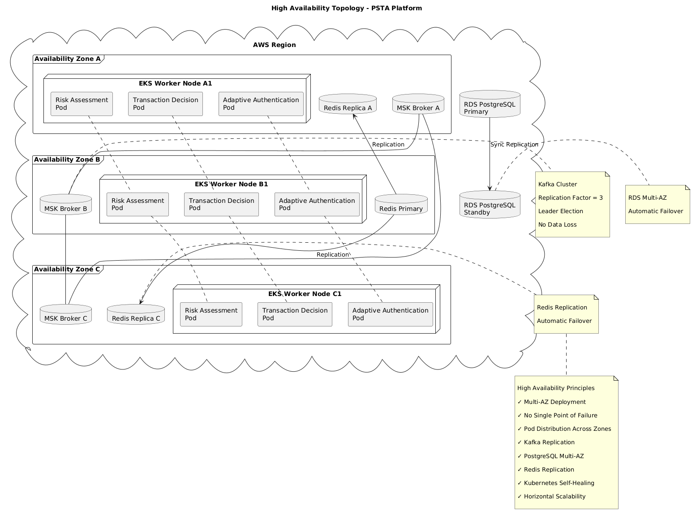

# Alta Disponibilidad (High Availability)

## Propósito

Este documento describe la estrategia de Alta Disponibilidad (HA) adoptada para la Plataforma de Seguridad Transaccional Adaptativa (PSTA).

El objetivo es garantizar la continuidad operativa de los servicios críticos de fraude y autenticación, minimizando interrupciones y eliminando puntos únicos de falla.

---

# Objetivos

La estrategia de alta disponibilidad debe garantizar:

- Disponibilidad superior al 99.95%.
- Tolerancia a fallos de infraestructura.
- Tolerancia a fallos de aplicaciones.
- Recuperación automática.
- Continuidad de procesamiento.
- Protección contra fallos zonales.

---

# Requerimientos de Disponibilidad

| Servicio | Disponibilidad Objetivo |
|-----------|-----------|
| Risk Assessment Service | 99.95% |
| Adaptive Authentication Service | 99.95% |
| Transaction Decision Service | 99.95% |
| Account Protection Service | 99.95% |
| Kafka (MSK) | 99.99% |
| PostgreSQL (RDS) | 99.95% |
| Redis (ElastiCache) | 99.95% |

---

# Estrategia General

La plataforma adopta un modelo:

```text
Multi-AZ
+
Auto Healing
+
Horizontal Scaling
+
Redundancia
```

---

# Arquitectura de Alta Disponibilidad



La plataforma opera sobre:

```text
AWS Region
```

con despliegue distribuido en:

```text
AZ-A
AZ-B
AZ-C
```

---

## Topología

```text
                     AWS Region

       ┌──────────────────────────────────┐
       │                                  │
       │           AWS EKS                │
       │                                  │
       └──────────────────────────────────┘

            /             |             \

         AZ-A           AZ-B          AZ-C

           │              │             │

         Pods           Pods          Pods
```

---

# Alta Disponibilidad de Kubernetes

## Múltiples Réplicas

Todos los servicios críticos deben ejecutarse con múltiples instancias.

Ejemplo:

```yaml
replicas: 3
```

---

## Distribución por Zona

Ejemplo:

```text
Risk Assessment

AZ-A → Pod 1

AZ-B → Pod 2

AZ-C → Pod 3
```

---

## Beneficio

La caída completa de una Availability Zone no genera indisponibilidad.

---

# Auto Healing

Kubernetes monitorea continuamente:

```text
Liveness Probe
Readiness Probe
```

---

## Escenario

```text
Pod Failure
      ↓
Kubernetes
      ↓
Recreación Automática
```

---

## Beneficio

No requiere intervención manual.

---

# Pod Disruption Budget (PDB)

Se configura para evitar indisponibilidad durante:

```text
Actualizaciones
Mantenimiento
Evicciones
```

---

## Ejemplo

```yaml
minAvailable: 2
```

---

## Resultado

Siempre permanecen pods disponibles.

---

# Alta Disponibilidad de Kafka

## Implementación

```text
AWS MSK
```

---

## Estrategia

Kafka se despliega sobre:

```text
3 Availability Zones
```

---

## Réplicas

```text
Replication Factor = 3
```

---

## Ejemplo

```text
Partition 1

Broker A
Broker B
Broker C
```

---

## Beneficio

La pérdida de un broker no implica pérdida de eventos.

---

# Alta Disponibilidad de PostgreSQL

## Implementación

```text
AWS RDS PostgreSQL
```

---

## Estrategia

```text
Multi-AZ
```

---

## Topología

```text
Primary
     ↓
Synchronous Replication
     ↓
Standby
```

---

## Beneficio

Failover automático.

---

# Alta Disponibilidad de Redis

## Implementación

```text
AWS ElastiCache Redis
```

---

## Estrategia

```text
Primary
+
Replica
```

---

## Failover

Automático.

---

## Beneficio

Las validaciones de velocidad continúan operando.

---

# Alta Disponibilidad del API Gateway

## Componentes

```text
AWS API Gateway
NGINX Ingress
```

---

## Beneficio

Distribución automática de tráfico.

---

# Balanceo de Carga

## Externo

```text
Internet
      ↓
API Gateway
```

---

## Interno

```text
Ingress
      ↓
Pods
```

---

## Algoritmo

```text
Round Robin
```

---

# Estrategia de Escalamiento

La alta disponibilidad se complementa con:

```text
HPA
+
KEDA
```

---

## HPA

Escala por:

```text
CPU
Memoria
```

---

## KEDA

Escala por:

```text
Kafka Lag
```

---

# Gestión de Fallos

## Fallo de Pod

```text
Pod Down
      ↓
Auto Healing
```

---

## Fallo de Nodo

```text
Node Failure
      ↓
Pods Reubicados
```

---

## Fallo de Availability Zone

```text
AZ Failure
      ↓
Pods continúan en otras AZ
```

---

## Fallo de Broker Kafka

```text
Broker Failure
      ↓
Replica Leader Election
```

---

## Fallo de Base de Datos

```text
Primary Failure
      ↓
Standby Promotion
```

---

# Estrategia de Actualizaciones

Se utiliza:

```text
Rolling Update
```

---

## Flujo

```text
Pod v1
     ↓
Pod v2
     ↓
Health Check
     ↓
Retiro Pod v1
```

---

## Beneficio

Sin indisponibilidad.

---

# Estrategia Canary

La plataforma incorpora:

```text
Canary Release
```

---

## Beneficio

Reducir impacto de despliegues defectuosos.

---

# Observabilidad para HA

## Métricas

```text
CPU
Memoria
Pod Availability
Kafka Lag
Latency
Error Rate
```

---

## Herramientas

```text
Prometheus
Grafana
CloudWatch
```

---

# Alertamiento

## Alertas Críticas

### Pod Availability

```text
Menos de 2 pods activos
```

---

### Kafka

```text
Broker Down
```

---

### PostgreSQL

```text
Failover Detectado
```

---

### Redis

```text
Replica No Disponible
```

---

# Eliminación de SPOF

La arquitectura elimina puntos únicos de falla mediante:

| Componente | Estrategia |
|------------|------------|
| EKS | Multi-AZ |
| Kafka | Replication Factor 3 |
| PostgreSQL | Multi-AZ |
| Redis | Replica + Failover |
| Microservicios | Múltiples Pods |
| API Gateway | Administrado |
| Ingress | Réplicas |

---

# Métricas Objetivo

## Disponibilidad

```text
99.95%
```

---

## MTTR

```text
< 15 minutos
```

---

## Recuperación de Pod

```text
< 1 minuto
```

---

## Recuperación de Nodo

```text
< 5 minutos
```

---

# Relación con la Arquitectura

Esta estrategia soporta directamente:

- Event-Driven Architecture.
- Kafka Backbone.
- Kubernetes.
- WebFlux.
- CQRS.
- Microservicios.

---

# Conclusión

La estrategia de alta disponibilidad propuesta garantiza continuidad operativa mediante una combinación de despliegue Multi-AZ, replicación de componentes críticos, recuperación automática y escalamiento dinámico. La solución elimina puntos únicos de falla y proporciona los niveles de disponibilidad esperados para una plataforma bancaria de prevención de fraude y autenticación adaptativa.