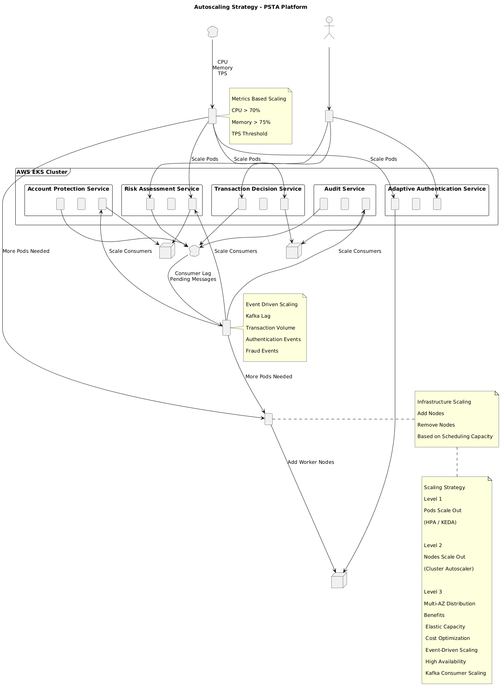

# Estrategia de Autoscaling

## Propósito

Este documento describe la estrategia de escalamiento automático adoptada para la Plataforma de Seguridad Transaccional Adaptativa (PSTA).

El objetivo es garantizar que la plataforma pueda responder dinámicamente a variaciones en la carga transaccional, manteniendo:

- Baja latencia.
- Alta disponibilidad.
- Uso eficiente de recursos.
- Optimización de costos.

La estrategia aprovecha las capacidades nativas de Kubernetes y mecanismos orientados a eventos.

---

# Objetivos

La estrategia de autoscaling debe permitir:

- Escalar automáticamente ante incrementos de carga.
- Reducir recursos cuando la demanda disminuye.
- Procesar picos transaccionales.
- Absorber ráfagas de eventos Kafka.
- Optimizar costos operativos.
- Mantener SLA de negocio.

---

# Motivación

Las plataformas antifraude presentan patrones de carga altamente variables.

Ejemplos:

```text
Pago de nómina
Black Friday
Cyber Monday
Fin de mes
Quincenas
Campañas comerciales
```

Durante estos eventos la carga puede incrementarse varias veces respecto al comportamiento normal.

---

# Estrategia General

La plataforma adopta una estrategia híbrida basada en:

```text
Horizontal Pod Autoscaler (HPA)
+
KEDA
```

---

# Arquitectura de Escalamiento



```text
Carga
  ↓

Métricas

  ↓

HPA
+
KEDA

  ↓

Escalamiento de Pods
```

---

# Componentes

## Horizontal Pod Autoscaler

Responsable de escalar utilizando métricas tradicionales.

Ejemplos:

```text
CPU
Memoria
```

---

## KEDA

Responsable de escalar utilizando eventos.

Ejemplos:

```text
Kafka Lag
Mensajes Pendientes
TPS
```

---

## Cluster Autoscaler

Responsable de escalar nodos cuando los pods ya no pueden ser programados.

```text
Pods ↑
     ↓
Nodos ↑
```

---

# Estrategia por Servicio

## Risk Assessment Service

### Características

Servicio altamente demandado.

Consume:

```text
TransactionReceived
```

---

### Escalamiento

```text
CPU
Kafka Lag
```

---

### Configuración Inicial

```yaml
minReplicas: 3
maxReplicas: 20
```

---

## Transaction Decision Service

### Características

Crítico para aprobación transaccional.

---

### Escalamiento

```text
CPU
TPS
```

---

### Configuración Inicial

```yaml
minReplicas: 3
maxReplicas: 15
```

---

## Adaptive Authentication Service

### Características

Carga variable.

---

### Escalamiento

```text
CPU
Authentication Requests
```

---

### Configuración Inicial

```yaml
minReplicas: 2
maxReplicas: 10
```

---

## Account Protection Service

### Características

Orientado a eventos.

---

### Escalamiento

```text
Kafka Lag
```

---

### Configuración Inicial

```yaml
minReplicas: 2
maxReplicas: 10
```

---

## Audit Service

### Características

Alto volumen de eventos.

---

### Escalamiento

```text
Kafka Lag
```

---

### Configuración Inicial

```yaml
minReplicas: 2
maxReplicas: 15
```

---

# Escalamiento Basado en CPU

## Objetivo

Responder a incremento de procesamiento.

---

## Umbral

```yaml
averageCPUUtilization: 70%
```

---

## Flujo

```text
CPU > 70%
      ↓
HPA
      ↓
Más Pods
```

---

# Escalamiento Basado en Memoria

## Objetivo

Evitar saturación.

---

## Umbral

```yaml
averageMemoryUtilization: 75%
```

---

## Flujo

```text
Memoria > 75%
        ↓
HPA
        ↓
Más Pods
```

---

# Escalamiento Basado en Kafka Lag

## Objetivo

Procesar acumulación de eventos.

---

## Métrica

```text
Consumer Lag
```

---

## Ejemplo

```text
Lag = 1000 mensajes
```

---

## Flujo

```text
Lag ↑
   ↓
KEDA
   ↓
Más Consumers
```

---

# Escalamiento Basado en TPS

## Objetivo

Proteger APIs críticas.

---

## Métrica

```text
Transactions Per Second
```

---

## Ejemplo

```text
TPS > 500
```

---

## Resultado

```text
Scale Out
```

---

# Escalamiento de Nodos

## Cluster Autoscaler

Cuando no existe capacidad suficiente:

```text
Pod Pending
      ↓
Cluster Autoscaler
      ↓
Nuevo Nodo
```

---

## Beneficio

Evita saturación del clúster.

---

# Escenarios de Escalamiento

## Escenario 1

### Incremento de Transferencias

```text
TransactionReceived ↑
```

---

Resultado:

```text
Risk Assessment ↑
Transaction Decision ↑
```

---

## Escenario 2

### Ataque Automatizado

```text
Eventos de fraude ↑
```

---

Resultado:

```text
Account Protection ↑
Audit Service ↑
```

---

## Escenario 3

### Pico de Autenticaciones

```text
OTP Requests ↑
```

---

Resultado:

```text
Adaptive Authentication ↑
```

---

# Escalamiento Reactivo

La plataforma utiliza:

```text
Spring WebFlux
```

---

Beneficio:

```text
Más solicitudes por Pod
```

comparado con arquitecturas bloqueantes.

---

# Estrategia de Scale Down

## Objetivo

Optimizar costos.

---

## Configuración

```yaml
stabilizationWindowSeconds: 300
```

---

## Beneficio

Evita:

```text
Scale Up
Scale Down
Scale Up
Scale Down
```

---

# Protección Contra Escalamiento Excesivo

## Límite de Réplicas

Ejemplo:

```yaml
maxReplicas: 20
```

---

## Beneficio

Control de costos.

---

# Observabilidad

## Métricas

```text
CPU
Memoria
Kafka Lag
TPS
Pod Count
Node Count
```

---

## Herramientas

```text
Prometheus
Grafana
CloudWatch
```

---

# Alertamiento

## Kafka Lag

```text
> 5.000 mensajes
```

---

## CPU

```text
> 85%
```

---

## Memoria

```text
> 90%
```

---

## Pod Pending

```text
> 1 minuto
```

---

# Estrategia de Costos

El autoscaling permite:

```text
Más capacidad cuando se necesita
Menos capacidad cuando no se necesita
```

---

## Resultado

Optimización de infraestructura.

---

# Relación con la Arquitectura

Esta estrategia soporta:

- Kubernetes.
- Kafka.
- WebFlux.
- Event-Driven Architecture.
- Microservicios.

---

# Relación con Otros Documentos

Complementa:

```text
kubernetes-topology.md
high-availability.md
hpa-keda-strategy.md
cost-estimation.md
```

---

# Conclusión

La estrategia de autoscaling propuesta permite a la plataforma adaptarse dinámicamente a cambios en la demanda, garantizando capacidad suficiente para procesar eventos financieros y antifraude en tiempo real. La combinación de HPA, KEDA y Cluster Autoscaler proporciona una solución escalable, eficiente y alineada con los principios Cloud Native adoptados para la arquitectura.