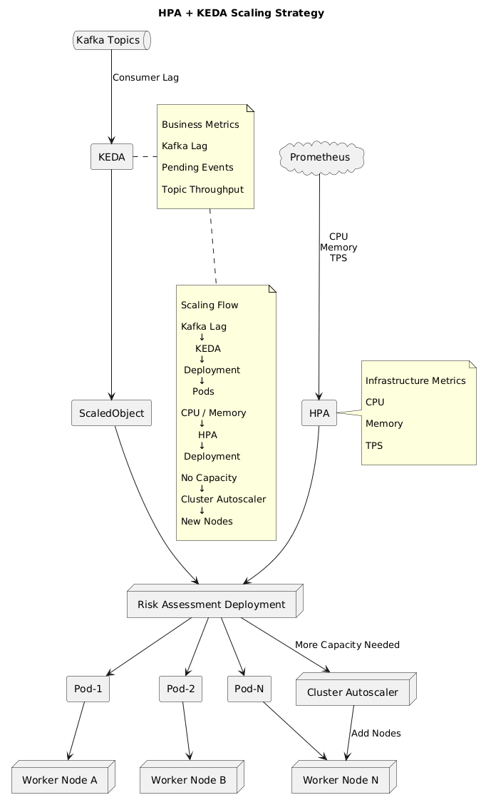

# Estrategia HPA + KEDA

## Propósito

Este documento describe la estrategia combinada de Horizontal Pod Autoscaler (HPA) y Kubernetes Event-Driven Autoscaling (KEDA) utilizada por la Plataforma de Seguridad Transaccional Adaptativa (PSTA).

El objetivo es proporcionar un mecanismo de escalamiento inteligente capaz de responder tanto a métricas tradicionales de infraestructura como a eventos de negocio en tiempo real.

---

# Motivación

La plataforma procesa eventos financieros y antifraude mediante una arquitectura orientada a eventos.

Existen dos tipos principales de carga:

## Carga Computacional

Generada por:

```text
Evaluación de riesgo
Autenticación
Correlación de fraude
Procesamiento de reglas
```

---

## Carga de Eventos

Generada por:

```text
Kafka Topics
Eventos transaccionales
Eventos de autenticación
Eventos de fraude
```

---

Cada tipo de carga requiere una estrategia de escalamiento diferente.

---

# Problema

Un HPA tradicional basado únicamente en:

```text
CPU
Memoria
```

no refleja correctamente la carga real de una plataforma Event-Driven.

Ejemplo:

```text
Kafka Lag = 50.000 mensajes

CPU = 20%
```

Desde la perspectiva de HPA:

```text
No escalar
```

Sin embargo:

```text
Existe una acumulación crítica de eventos
```

---

# Decisión

La plataforma adopta una estrategia híbrida basada en:

```text
HPA
+
KEDA
```

---

# Responsabilidades

## HPA

Responsable de:

```text
CPU
Memoria
TPS
```

---

## KEDA

Responsable de:

```text
Kafka Lag
Eventos pendientes
Carga asíncrona
```

---

# Arquitectura



---

# Horizontal Pod Autoscaler

## Objetivo

Escalar servicios utilizando métricas de infraestructura.

---

## Métricas

### CPU

```yaml
averageUtilization: 70
```

---

### Memoria

```yaml
averageUtilization: 75
```

---

### TPS

Métrica personalizada.

---

## Flujo

```text
CPU ↑
   ↓
HPA
   ↓
Más Pods
```

---

# Kubernetes Event-Driven Autoscaling

## Objetivo

Escalar consumidores de eventos basándose en demanda real.

---

## Fuente Principal

```text
Kafka
```

---

## Métrica

```text
Consumer Lag
```

---

## Ejemplo

```text
Lag = 10.000 mensajes
```

---

## Resultado

```text
Escalar Consumers
```

---

# Estrategia por Servicio

## Risk Assessment Service

### HPA

```text
CPU
Memoria
```

---

### KEDA

```text
TransactionReceived Lag
```

---

### Configuración

```yaml
minReplicaCount: 3
maxReplicaCount: 20
```

---

## Adaptive Authentication Service

### HPA

```text
CPU
Memoria
```

---

### KEDA

```text
Authentication Events
```

---

### Configuración

```yaml
minReplicaCount: 2
maxReplicaCount: 10
```

---

## Transaction Decision Service

### HPA

```text
CPU
TPS
```

---

### KEDA

No aplica directamente.

---

### Configuración

```yaml
minReplicas: 3
maxReplicas: 15
```

---

## Account Protection Service

### HPA

```text
CPU
Memoria
```

---

### KEDA

```text
Fraud Events Lag
```

---

### Configuración

```yaml
minReplicaCount: 2
maxReplicaCount: 10
```

---

## Audit Service

### HPA

```text
CPU
Memoria
```

---

### KEDA

```text
Audit Events Lag
```

---

### Configuración

```yaml
minReplicaCount: 2
maxReplicaCount: 15
```

---

# Kafka Scaling Strategy

## Topics

```text
transaction-events
risk-events
authentication-events
account-events
audit-events
```

---

## Consumer Groups

Cada servicio posee:

```text
Consumer Group independiente
```

---

## Beneficio

Escalamiento independiente.

---

# KEDA Trigger Ejemplo

```yaml
apiVersion: keda.sh/v1alpha1
kind: ScaledObject

spec:

  scaleTargetRef:
    name: risk-assessment-service

  minReplicaCount: 3
  maxReplicaCount: 20

  triggers:

    - type: kafka
      metadata:
        bootstrapServers: kafka:9092
        consumerGroup: risk-group
        topic: transaction-events
        lagThreshold: "1000"
```

---

# HPA Ejemplo

```yaml
apiVersion: autoscaling/v2
kind: HorizontalPodAutoscaler

spec:

  minReplicas: 3
  maxReplicas: 20

  metrics:

    - type: Resource

      resource:
        name: cpu

        target:
          averageUtilization: 70
```

---

# Estrategia de Escalamiento

## Nivel 1

Escalamiento de Pods.

```text
HPA
+
KEDA
```

---

## Nivel 2

Escalamiento de Nodos.

```text
Cluster Autoscaler
```

---

## Flujo Completo

```text
Eventos ↑

    ↓

Kafka Lag ↑

    ↓

KEDA

    ↓

Pods ↑

    ↓

Sin capacidad

    ↓

Cluster Autoscaler

    ↓

Nuevos Nodos
```

---

# Escenarios de Negocio

## Pico de Transferencias

```text
TransactionReceived ↑
```

---

Resultado:

```text
Risk Assessment Scale Out
```

---

## Ataque de Fraude

```text
Fraud Events ↑
```

---

Resultado:

```text
Account Protection Scale Out
```

---

## Pico de Auditoría

```text
Audit Events ↑
```

---

Resultado:

```text
Audit Service Scale Out
```

---

# Scale Down

## Objetivo

Reducir costos.

---

## Configuración

```yaml
cooldownPeriod: 300
```

---

## Beneficio

Evita oscilaciones.

---

# Protección Contra Escalamiento Excesivo

## Máximo de Réplicas

Ejemplo:

```yaml
maxReplicaCount: 20
```

---

## Beneficio

Control de costos.

---

# Observabilidad

## Métricas HPA

```text
CPU
Memoria
TPS
```

---

## Métricas KEDA

```text
Kafka Lag
Pending Events
Consumer Throughput
```

---

## Herramientas

```text
Prometheus
Grafana
CloudWatch
```

---

# Alertas

## Kafka Lag

```text
> 5.000 eventos
```

---

## Escalamiento Máximo Alcanzado

```text
maxReplicaCount
```

---

## Saturación de Nodos

```text
Node Utilization > 90%
```

---

# Beneficios

## Elasticidad

Escala según demanda real.

---

## Eficiencia

Optimiza recursos.

---

## Resiliencia

Reduce riesgo de acumulación de eventos.

---

## Costos

Evita sobreaprovisionamiento.

---

# Relación con la Arquitectura

La estrategia HPA + KEDA soporta directamente:

- Event-Driven Architecture.
- Kafka Backbone.
- Kubernetes.
- Spring WebFlux.
- Microservicios Reactivos.

---

# Relación con Otros Documentos

Complementa:

```text
kubernetes-topology.md
high-availability.md
autoscaling.md
cost-estimation.md
```

---

# Conclusión

La combinación de HPA y KEDA proporciona una estrategia de escalamiento adaptada a una arquitectura moderna basada en eventos. Mientras HPA responde a la utilización de recursos de infraestructura, KEDA permite reaccionar directamente a la carga de negocio representada por eventos Kafka, garantizando una plataforma más eficiente, resiliente y alineada con los requerimientos de procesamiento en tiempo real de la solución antifraude.